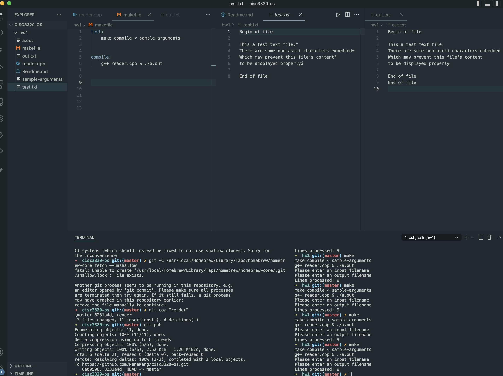

# System Calls Application


To run the test run:

```
make
```

## Process calls made 

Systems calls that might be needed internally for the program to run:

- exit: Terminate the execution of the program
- open: For opening file to read. (target file provided)
- create: Used when creating a new file (where we store our ouput)
- close: For closing filestreams once we finish writting on them.
- fork: for creating new processes. Could be used for starting interneal new process
- exec: For replacing the process, Could had been used together with `fork` to control the processes 
- wait: For parent process that may wait for a termination of a child process
- read to fd 1: for detecting user typing a character
- write to fd 1: For printing output
- mmap: Mapping files into memory (out.txt and test.txt) Migh had been used to map the txt files into memory
- access: Checks user's permission for a file. Might had been used before reading a file
- send: To send messages between processes, might had been used for internal communication between different processes
- receive: Receive messages from processes, might had been used for internal communication between different processes
- link, symlink: Creating name for files. Might had been used when naming the created files based on our inputs





