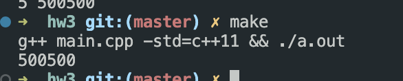
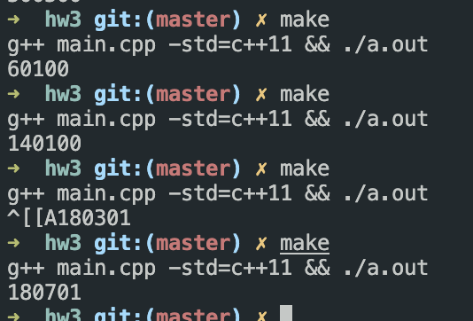

# Hw 3 - Assigment


Run:

```
make
```

Expected Result:

```
500500
```

## With Mutex



```cpp
void sumAll(int range, int start, int arrayNums[])
{

    for (int i = start; i < range; i++)
    {
        m.lock();
        int temp = sum + arrayNums[i];
        usleep(1);
        sum = temp;
        m.unlock();
        // cout << "THREAD" << range<< endl;
    }
}
```


## Without Mutex




```cpp
Some random number
```


