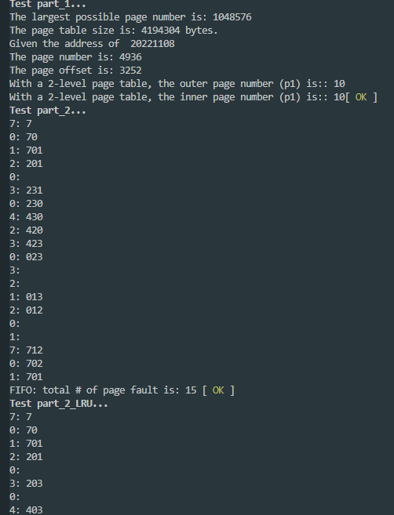

## CISC 3320 HW

Testfile found in test_unit.cpp

Run: (windows)

```
make
```

Or in Mac run:

```
make hw4-mac
```



I copied the result down here.

```expected output
Test part_1... 
The largest possible page number is: 1048576
The page table size is: 4194304 bytes.
Given the address of  20221108
The page number is: 4936
The page offset is: 3252
With a 2-level page table, the outer page number (p1) is:: 10
With a 2-level page table, the inner page number (p1) is:: 10[ OK ]
Test part_2... 
7: 7
0: 70
1: 701
2: 201
0:
3: 231
0: 230
4: 430
2: 420
3: 423
0: 023
3:
2:
1: 013
2: 012
0:
1:
7: 712
0: 702
1: 701
FIFO: total # of page fault is: 15 [ OK ]
Test part_2_LRU... 
7: 7
0: 70
1: 701
2: 201
0:
3: 203
0:
4: 403
2: 402
3: 432
0: 032
3:
2:
1: 132
2:
0: 102
1:
7: 107
0:
1:
LRU using 70120304230321201701 : total # of page fault is: 12 [ OK ]
Test part_2_belady... 
1: 1
2: 12
3: 123
4: 423
1: 413
2: 412
5: 512
1:
2:
3: 532
4: 534
5:
3 Frames FIFO: total # of page fault is: 9
1: 1
2: 12
3: 123
4: 1234
1:
2:
5: 5234
1: 5134
2: 5124
3: 5123
4: 4123
5: 4523
4 Frames FIFO: total # of page fault is: 10 [ OK ]
Test part_3_opt... 
7: 7
0: 70
1: 701
2: 201
0:
3: 203
0:
4: 243
2:
3:
0: 203
3:
2:
1: 201
2:
0:
1:
7: 701
0:
1:
Optimal using 70120304230321201701 : total # of page fault is: 9 [ OK ]
Test part_3_opt_random... 
FIFO, with 1 pages : total # of page fault is: 89
LRU, with 1 pages : total # of page fault is: 89
Optimal, with 1 pages : total # of page fault is: 89


FIFO, with 2 pages : total # of page fault is: 85
LRU, with 2 pages : total # of page fault is: 85
Optimal, with 2 pages : total # of page fault is: 68


FIFO, with 3 pages : total # of page fault is: 76
LRU, with 3 pages : total # of page fault is: 76
Optimal, with 3 pages : total # of page fault is: 52


FIFO, with 4 pages : total # of page fault is: 66
LRU, with 4 pages : total # of page fault is: 68
Optimal, with 4 pages : total # of page fault is: 39


FIFO, with 5 pages : total # of page fault is: 54
LRU, with 5 pages : total # of page fault is: 55
Optimal, with 5 pages : total # of page fault is: 31


FIFO, with 6 pages : total # of page fault is: 45
LRU, with 6 pages : total # of page fault is: 45
Optimal, with 6 pages : total # of page fault is: 24


FIFO, with 7 pages : total # of page fault is: 37
LRU, with 7 pages : total # of page fault is: 33
Optimal, with 7 pages : total # of page fault is: 19

[ OK ]
```