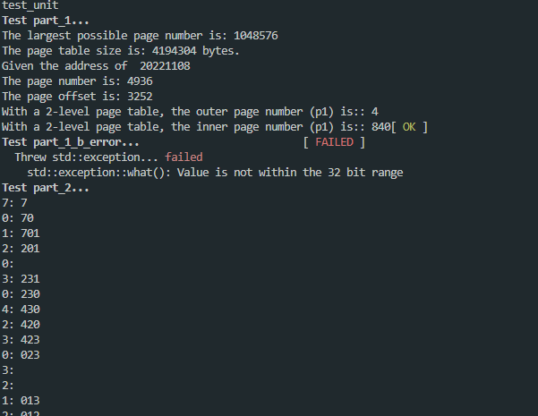

## CISC 3320 HW

Testfile found in test_unit.cpp

Run: (windows)

```
make
```

Or in Mac run:

```
make hw4-mac
```



I copied the result down here.

```expected output
test_unit
Test part_1... 
The largest possible page number is: 1048576
The page table size is: 4194304 bytes.
Given the address of  20221108
The page number is: 4936
The page offset is: 3252
With a 2-level page table, the outer page number (p1) is:: 4
With a 2-level page table, the inner page number (p1) is:: 840[ OK ]
Test part_1_b_error...                          [ FAILED ]
  Threw std::exception... failed
    std::exception::what(): Value is not within the 32 bit range
Test part_2... 
7: 7
0: 70
1: 701
2: 201
0:
3: 231
0: 230
4: 430
2: 420
3: 423
0: 023
3:
2:
1: 013
2: 012
0:
1:
7: 712
0: 702
1: 701
FIFO: total # of page fault is: 15 [ OK ]
Test part_2_LRU... 
7: 7
0: 70
1: 701
2: 201
0:
3: 203
0:
4: 403
2: 402
3: 432
0: 032
3:
2:
1: 132
2:
0: 102
1:
7: 107
0:
1:
LRU using 70120304230321201701 : total # of page fault is: 12 [ OK ]
Test part_2_belady... 
1: 1
2: 12
3: 123
4: 423
1: 413
2: 412
5: 512
1:
2:
3: 532
4: 534
5:
3 Frames FIFO: total # of page fault is: 9
1: 1
2: 12
3: 123
4: 1234
1:
2:
5: 5234
1: 5134
2: 5124
3: 5123
4: 4123
5: 4523
4 Frames FIFO: total # of page fault is: 10 [ OK ]
Test part_3_opt... 
7: 7
0: 70
1: 701
2: 201
0:
3: 203
0:
4: 243
2:
3:
0: 203
3:
2:
1: 201
2:
0:
1:
7: 701
0:
1:
Optimal using 70120304230321201701 : total # of page fault is: 9 [ OK ]
Test part_3_opt_partial... 
1: 907, 907(0%), 907(0%)
2: 654, 809(23%), 809(23%)
3: 491, 713(45%), 722(47%)
4: 374, 609(62%), 627(67%)
5: 278, 506(82%), 517(85%)
6: 202, 409(102%), 409(102%)
7: 136, 308(126%), 305(124%)[ OK ]
FAILED: 1 of 7 unit tests has failed.
```